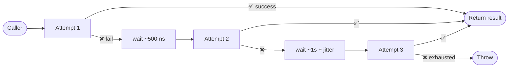
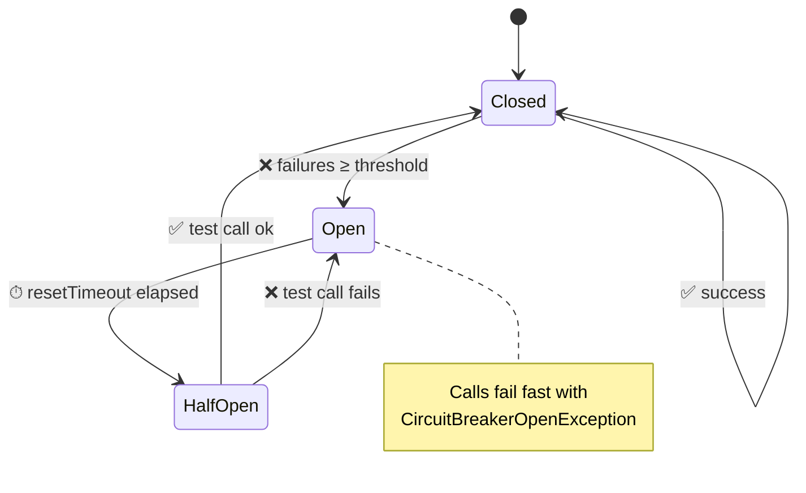
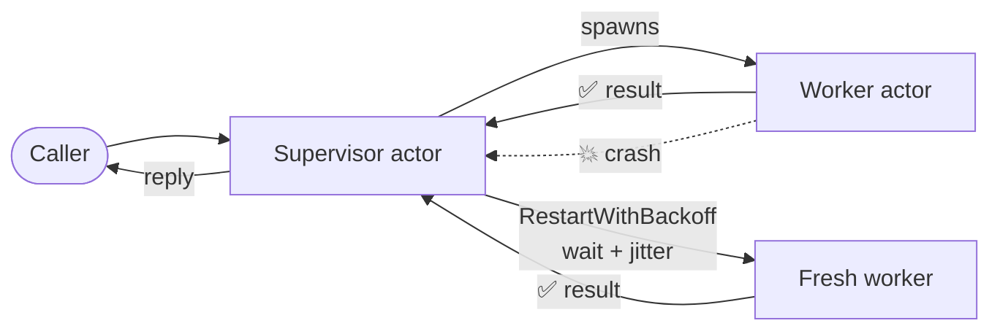
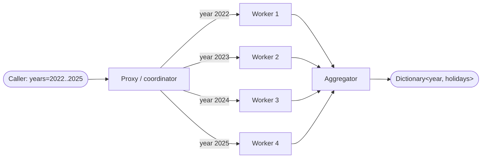
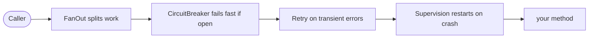

# Oasis.Resilience

An Akka.NET-based resilience framework that uses AOP (DispatchProxy) to add retry, circuit breaker, supervision, and fan-out patterns to your service interfaces via declarative attributes.

## Installation

```shell
dotnet add package Oasis.Resilience
```

## Quick Start

### 1. Define a service interface

```csharp
public interface IMyService
{
    Task<string> GetDataAsync();
}
```

### 2. Implement the service with resilience attributes

```csharp
public class MyService : IMyService
{
    [Retry(maxAttempts: 3, initialDelay: 1000)]
    public async Task<string> GetDataAsync() { ... }
}

// In your composition root:
services.AddResilience();
services.AddResilientService<IMyService, MyService>();
```

### 3. Use the service

```csharp
var service = serviceProvider.GetRequiredService<IMyService>();
var result = await service.GetDataAsync();
```

Every call to `GetDataAsync` is now automatically intercepted and wrapped with the declared resilience policies.

---

## Resilience patterns at a glance

These are the four AOP-enabled features. Pick the one that matches the failure mode you're trying to handle.

### 🔁 Retry — `[Retry]`

**What it does.** If the method throws, automatically calls it again — up to `maxAttempts` times — with an exponentially growing delay between attempts (plus a small random jitter so many clients don't retry in lock-step).

**When to use it.** For *transient* failures that usually go away on a second try: a flaky network, a brief HTTP 503, a database deadlock, a timeout. Don't use it for permanent errors (validation, 401, 404) — you'll just waste time.



```csharp
[Retry(maxAttempts: 4, initialDelay: 500)]
public Task<string> GetDataAsync() { ... }
```

### ⚡ Circuit Breaker — `[CircuitBreaker]`

**What it does.** Counts consecutive failures. After `failureThreshold` failures the breaker **opens** and every following call fails fast with `CircuitBreakerOpenException` instead of hammering the broken dependency. After `resetTimeout` ms it goes **half-open** and lets a single test call through; success closes the circuit, failure re-opens it immediately.

**When to use it.** When a downstream service is *down or seriously degraded* and continuing to call it would only make things worse (cascading failures, exhausted thread pools, growing queues). The breaker gives the dependency time to recover.

**Combine with Retry.** `[Retry] + [CircuitBreaker]` is the classic combo: retry handles transient blips, the breaker stops the bleeding when blips become an outage.



```csharp
[CircuitBreaker(failureThreshold: 3, resetTimeout: 15000)]
[Retry(maxAttempts: 3, initialDelay: 500)]
public Task<string> GetInventoryAsync() { ... }
```

### 🛡️ Supervision — `[Supervision]`

**What it does.** Runs the call inside a supervised Akka.NET actor. If the actor crashes, the supervisor restarts it according to the chosen strategy (`Restart`, `RestartWithBackoff`, `Resume`, `Stop`, `Escalate`) — with optional exponential backoff and jitter between restarts.

**When to use it.** For long-lived or stateful operations where you want the *runtime* to recover from crashes the way Erlang/Akka do — "let it crash, then restart it cleanly". This is more about *process supervision* than per-call retries; use Retry for "try again now", Supervision for "rebuild the worker after it died".



```csharp
[Supervision(strategy: SupervisionStrategy.RestartWithBackoff, maxRetries: 5)]
public Task<string> RunBackgroundJobAsync() { ... }
```

### 🪂 Fan-Out — `[FanOut]`

**What it does.** Splits a collection parameter into work items and dispatches each one to a pool of worker actors in parallel. Results are collected and aggregated back into a single return value via the registered message factory + result aggregator.

**When to use it.** When a single call processes a list and each item is independent — fetching holidays for many years, validating many records, calling a downstream API once per id. Fan-out turns a sequential O(n) call into a parallel one bounded by `maxWorkers`.



```csharp
[FanOut(workerActorType: typeof(HolidayWorkerActor), splitParameterName: "years", maxWorkers: 4)]
public Task<Dictionary<int, string>> GetHolidaysForYearsAsync(int[] years, string country) { ... }
```

You also register *how* to build a worker message and *how* to combine the results once at startup:

```csharp
ResilientProxy<IHolidayService>.RegisterMessageFactory((workerType, splitValue, parameters, otherArgs) =>
    new HolidayWorkerActor.ProcessYear((int)splitValue, (string)otherArgs[0]));

ResilientProxy<IHolidayService>.RegisterResultAggregator((results, workerType, returnType) =>
    results.Cast<HolidayWorkerActor.YearProcessed>().ToDictionary(r => r.Year, r => r.Content));
```

### Stacking attributes

Attributes compose — apply more than one to a single method and the proxy applies them outside-in:
**Fan-Out → Circuit Breaker → Retry → Supervision → your method**. So a fan-out worker call can itself be retried, and the breaker can short-circuit the whole thing once the dependency is clearly down.



---

## Configuration

Call `AddResilience` during startup to register the resilience infrastructure:

```csharp
services.AddResilience(
    configureRetryOptions: options => options.LogLevel = LogLevel.Debug,
    configureBreakerOptions: options =>
    {
        options.DefaultFailureThreshold = 3;
        options.DefaultResetTimeout = 15000;
    },
    configureSupervisionOptions: options =>
    {
        options.DefaultStrategy = SupervisionStrategy.RestartWithBackoff;
        options.DefaultMaxRetries = 5;
    },
    configureFanOutOptions: options =>
    {
        options.DefaultMaxWorkers = 10;
    });
```

All configuration delegates are optional. The values you set become the global defaults used when attributes omit their corresponding parameters.

### RetryOptions

| Property | Type | Default | Description |
|----------|------|---------|-------------|
| `LogLevel` | `LogLevel` | `Debug` | Controls the log level for resilience tracing output |
| `DefaultMaxAttempts` | `int` | `5` | Default number of attempts when `[Retry]` omits `maxAttempts` |
| `DefaultInitialDelayMs` | `int` | `2000` | Default initial backoff delay in milliseconds (doubled each attempt) |
| `MaxDelayMs` | `int` | `30000` | Upper bound for the exponential backoff delay between retries |
| `JitterFactor` | `double` | `0.2` | Random jitter applied to each backoff (0 = none, 1 = ±100%) |
| `AskTimeout` | `TimeSpan` | `30s` | Timeout for actor `Ask` calls used internally by the proxy |

Example tuning retry behaviour and disabling logs in tests:

```csharp
services.AddResilience(configureRetryOptions: options =>
{
    options.LogLevel = LogLevel.None;
    options.MaxDelayMs = 5_000;
    options.JitterFactor = 0.3;
    options.AskTimeout = TimeSpan.FromSeconds(10);
});
```

### CircuitBreakerOptions

| Property | Type | Default | Description |
|----------|------|---------|-------------|
| `DefaultFailureThreshold` | `int` | `5` | Default number of consecutive failures before the circuit opens |
| `DefaultResetTimeout` | `int` | `30000` | Default duration in milliseconds before transitioning to half-open |
| `DefaultMaxConcurrentCalls` | `int` | `1` | Default max concurrent test calls in half-open state |

### SupervisionOptions

| Property | Type | Default | Description |
|----------|------|---------|-------------|
| `DefaultStrategy` | `SupervisionStrategy` | `RestartWithBackoff` | Default supervision strategy |
| `DefaultMaxRetries` | `int` | `5` | Default max retry attempts |
| `DefaultBackoffMinMs` | `int` | `2000` | Default minimum backoff in milliseconds |
| `DefaultBackoffMaxMs` | `int` | `30000` | Default maximum backoff in milliseconds |
| `DefaultRandomFactor` | `double` | `0.2` | Default jitter random factor (0 = no jitter) |

### FanOutOptions

| Property | Type | Default | Description |
|----------|------|---------|-------------|
| `DefaultMaxWorkers` | `int` | `5` | Default maximum worker actors for fan-out |

---

## Attributes Reference

### `[Retry]`

Re-executes a failed method with exponential backoff. Applies to transient failures such as network timeouts or temporary service unavailability.

```csharp
public class MyService : IMyService
{
    [Retry(maxAttempts: 5, initialDelay: 2000)]
    public async Task<string> FetchDataAsync() { ... }
}
```

**Parameters**

| Parameter | Type | Default | Description |
|-----------|------|---------|-------------|
| `maxAttempts` | `int` | `5` | Maximum number of execution attempts including the first |
| `initialDelay` | `int` | `2000` | Initial delay in milliseconds before the first retry |

**Behavior**

- The method is executed on the first attempt. If it succeeds, the result is returned immediately.
- On failure (any exception), the actor waits for `initialDelay * 2^(attempt - 1)` milliseconds before retrying (exponential backoff).
- Retries continue until either the method succeeds or `maxAttempts` is exhausted.
- When all attempts fail, the last exception is propagated to the caller.

**Example scenario**: A `maxAttempts: 3, initialDelay: 1000` configuration produces delays of approximately 1s, then 2s between attempts before giving up.

---

### `[CircuitBreaker]`

Prevents cascading failures by opening the circuit after a configurable number of consecutive failures, allowing the system to recover.

```csharp
public class InventoryService : IInventoryService
{
    [CircuitBreaker(failureThreshold: 3, resetTimeout: 10000, maxConcurrentCalls: 2)]
    public async Task<string> GetInventoryAsync() { ... }
}
```

**Parameters**

| Parameter | Type | Default | Description |
|-----------|------|---------|-------------|
| `failureThreshold` | `int` | `5` | Number of consecutive failures before the circuit opens |
| `resetTimeout` | `int` | `30000` | Duration in milliseconds the circuit stays open before transitioning to half-open |
| `maxConcurrentCalls` | `int` | `1` | Number of test calls allowed in half-open state |

**State machine**

The circuit breaker cycles through three states:

```
         failures >= threshold
  Closed ──────────────────────────► Open
    ▲                                   │
    │                                   │
    │        resetTimeout elapsed       │
    │    ┌──────────────────────────────┘
    │    ▼
    │  HalfOpen
    │      │
    └──────┘
   success resets to Closed
```

- **Closed**: Normal operation. All calls pass through. Failures are counted.
- **Open**: Calls are rejected immediately with a `CircuitBreakerOpenException` without executing the method body. After `resetTimeout` milliseconds, transitions to half-open.
- **HalfOpen**: A limited number of test calls (`maxConcurrentCalls`) are allowed through. If a test call succeeds, the circuit resets to Closed. If it fails, the circuit re-opens.

**Combining with `[Retry]`**: Use both attributes on the same method to handle transient errors with retries while preventing cascade failures via the circuit breaker. Retry is evaluated first — only after retries are exhausted does the failure count toward the circuit breaker threshold.

```csharp
public class InventoryService : IInventoryService
{
    [CircuitBreaker(failureThreshold: 3, resetTimeout: 10000, maxConcurrentCalls: 2)]
    [Retry(maxAttempts: 4, initialDelay: 1000)]
    public async Task<string> GetInventoryAsync() { ... }
}
```

---

### `[Supervision]`

Wraps method execution in an Akka.NET supervised actor, providing fault-tolerant execution with configurable failure strategies.

```csharp
public class DataProcessor : IDataProcessor
{
    [Supervision(strategy: SupervisionStrategy.RestartWithBackoff, maxRetries: 5)]
    public async Task<string> ProcessDataAsync() { ... }
}
```

**Parameters**

| Parameter | Type | Default | Description |
|-----------|------|---------|-------------|
| `strategy` | `SupervisionStrategy` | `RestartWithBackoff` | What to do when the actor fails |
| `maxRetries` | `int` | `5` | Maximum retry attempts before giving up |
| `backoffMinMs` | `int` | `2000` | Minimum backoff duration in milliseconds |
| `backoffMaxMs` | `int` | `30000` | Maximum backoff duration in milliseconds |
| `randomFactor` | `double` | `0.2` | Random jitter factor (adds `[-factor, +factor]` variance to backoff) |

**Strategies**

| Strategy | Behavior |
|----------|----------|
| `Restart` | Stops the actor and creates a new instance. The actor's state is lost. |
| `Stop` | Permanently stops the actor. No further attempts. |
| `Escalate` | Forwards the failure to the parent supervisor, which applies its own strategy. |
| `Resume` | Continues running the actor without restart. The actor retains its state and continues processing the next message. |
| `RestartWithBackoff` | Restarts the actor with exponential backoff (`backoffMinMs * 2^retry`) plus jitter, up to `backoffMaxMs`. Most practical for external service calls — avoids hammering a downed service with rapid restart attempts. |

**When to use each strategy**

- **RestartWithBackoff**: Default choice for I/O operations, external API calls, and database queries. The backoff gives dependencies time to recover.
- **Restart**: Use when the actor holds no critical state and should be quickly retried without delay.
- **Resume**: Use when the actor manages important in-memory state that must be preserved.
- **Stop**: Use when the failure is fatal and retrying would be pointless.
- **Escalate**: Use in nested supervision hierarchies where the parent should decide the overall strategy.

---

### `[FanOut]`

Splits a collection parameter and distributes work items across multiple worker actors for parallel processing.

```csharp
public class BatchProcessor : IBatchProcessor
{
    [FanOut(workerActorType: typeof(MyWorkerActor), splitParameterName: "items", maxWorkers: 5)]
    public async Task<List<Result>> ProcessBatchAsync(int[] items, string category) { ... }
}
```

**Parameters**

| Parameter | Type | Default | Description |
|-----------|------|---------|-------------|
| `workerActorType` | `Type` | (required) | The Akka.NET actor type that processes each split work item |
| `splitParameterName` | `string` | (required) | The parameter name (from the method signature) whose value is an enumerable to split across workers |
| `maxWorkers` | `int` | `5` | Maximum number of worker actors to spawn |

**Registration requirements**

Before using fan-out, you must register a **message factory** and a **result aggregator** for the service interface:

```csharp
// Create a worker message from a split value + non-split parameters
ResilientProxy<IMyService>.RegisterMessageFactory(
    (workerType, splitValue, parameters, otherArgs) =>
    {
        if (workerType == typeof(MyWorkerActor))
        {
            var item = (int)splitValue;
            var category = (string)otherArgs[0];
            return new MyWorkerActor.ProcessItem(item, category);
        }
        throw new InvalidOperationException($"Unknown worker: {workerType.Name}");
    });

// Aggregate worker results back into the method's return type
ResilientProxy<IMyService>.RegisterResultAggregator(
    (results, workerType, returnType) =>
    {
        if (returnType == typeof(List<Result>) && workerType == typeof(MyWorkerActor))
        {
            return results.Cast<MyWorkerActor.ItemProcessed>()
                .Select(r => new Result(r.Id, r.Data))
                .ToList();
        }
        throw new InvalidOperationException($"Unknown return type: {returnType.Name}");
    });
```

**Message factory signature**

```csharp
Func<Type workerType, object splitValue, ParameterInfo[] parameters, object[] otherArgs, object>
```

| Parameter | Description |
|-----------|-------------|
| `workerType` | The actor type specified in `workerActorType` |
| `splitValue` | A single element from the split collection (e.g., one `int` from an `int[]`) |
| `parameters` | The method's `ParameterInfo[]` for reflection-based mapping |
| `otherArgs` | All method arguments except the split parameter, in declaration order |

**Result aggregator signature**

```csharp
Func<object[] results, Type workerType, Type returnType, object>
```

| Parameter | Description |
|-----------|-------------|
| `results` | Array of response objects collected from all workers |
| `workerType` | The actor type used for processing |
| `returnType` | The return type of the decorated method |
| Returns | The aggregated result matching the method's return type |

**Behavior**

1. The split parameter (identified by `splitParameterName`) is iterated.
2. Up to `maxWorkers` actors are spawned, each receiving one element via the message factory.
3. Workers process in parallel. Each worker's result is collected.
4. When all workers complete, the result aggregator combines individual results into the method's return type.
5. Fan-out can be combined with `[Supervision]` so that individual worker failures trigger the configured supervision strategy.

```csharp
public class HolidayService : IHolidayService
{
    [FanOut(workerActorType: typeof(HolidayWorkerActor), splitParameterName: "years", maxWorkers: 5)]
    [Supervision(strategy: SupervisionStrategy.RestartWithBackoff)]
    public async Task<Dictionary<int, string>> GetHolidaysForYearsAsync(int[] years, string country) { ... }
}
```

---

## Combining Patterns

Attributes can be stacked on the same method. The framework evaluates them in this order:

1. **Supervision** — wraps the entire execution in a supervised actor
2. **FanOut** — splits work across workers (if applicable)
3. **CircuitBreaker** — checks if the circuit is open before allowing the call
4. **Retry** — retries on failure with exponential backoff

```csharp
public class InventoryService : IInventoryService
{
    [CircuitBreaker(failureThreshold: 3, resetTimeout: 10000)]
    [Retry(maxAttempts: 4, initialDelay: 1000)]
    public async Task<string> GetInventoryAsync() { ... }
}
```

In this combination, retry handles transient failures up to 4 attempts. If the service remains unavailable, the circuit breaker opens after 3 such failures, preventing further calls for 10 seconds.

---

## Architecture

- **DispatchProxy** intercepts method calls at runtime via `AddResilientService<TInterface, TImpl>()`.
- **Akka.NET actors** execute the actual resilience logic in isolation — retry scheduling, circuit breaker state, and supervision are all managed inside the actor system.
- **Attribute reflection** is cached per `MethodInfo` for performance.
- **Fan-out** uses the `Ask` pattern to collect results from worker actors, aggregated back into the method's return type.

## Project Structure

| Directory | Purpose |
|-----------|---------|
| `Attributes/` | `RetryAttribute`, `CircuitBreakerAttribute`, `SupervisionAttribute`, `FanOutAttribute` |
| `Actors/` | `RetryActor`, `CircuitBreakerActor`, `SupervisorActor`, worker actor logic |
| `Proxies/` | `ResilientProxy<T>` — the DispatchProxy that intercepts calls |
| `Runtime/` | `ResilienceRuntime` — bootstraps the Akka.NET actor system |
| `Extensions/` | `ResilienceRegistration` — DI integration |
